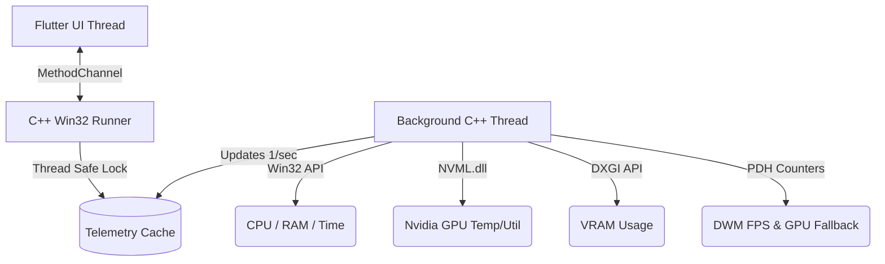

# Gaming Stats Overlay 🎮📈

A lightweight, high-performance, and visually customizable gaming telemetry overlay for Windows. Built using **Flutter** for a sleek cyberpunk UI and **Native C++** for zero-stutter background statistics tracking.

Unlike traditional overlays that spawn heavy PowerShell or `typeperf` child processes and cause in-game stuttering, this application queries Win32, PDH, DXGI, and NVML (Nvidia) APIs directly from a dedicated C++ background worker thread, ensuring virtually **0% CPU overhead**.

---

## Key Features

- **Direct Native Telemetry**:
  - **FPS & Frametimes**: Real-time frame tracking via the Desktop Window Manager (DWM) composition counters.
  - **CPU**: Utilization (via `GetSystemTimes`) and Core Temperature (via WMI).
  - **GPU**: Utilization, Temperature, and Clocks (powered by dynamic loading of NVML for NVIDIA, with fallback counters).
  - **RAM**: Memory utilization (via `GlobalMemoryStatusEx`).
  - **VRAM**: Local video memory allocations (via `DXGI QueryVideoMemoryInfo`).
  - **Battery & Clock**: Battery level (for laptops) and high-precision system clock.
- **Customizable Cyberpunk Aesthetics**:
  - Interactive dashboard UI with sliders for **Font Size** and **Background Opacity**.
  - Neon-themed high-contrast preset color pickers.
  - Custom multi-layered drop-shadow/text-outline styling to ensure 100% visibility against dark, bright, or chaotic game environments.
- **Ghost Mode (Overlay Mode)**:
  - Shrinks the window into a compact floating layout.
  - Lock/Unlock toggle. When locked, it sits always-on-top and can be configured as fully **click-through** so it does not interfere with gameplay.
- **Persistent Dragging**:
  - Seamlessly reposition the overlay by dragging it. Position coordinates are persistently saved to `SharedPreferences` so it opens exactly where you left it.
- **System Tray Control**:
  - A taskbar system tray integration allowing you to easily unlock the menu or exit the application even when the overlay is in click-through Ghost Mode.

---

## Technical Architecture

The application splits its responsibilities to prioritize rendering speed and execution efficiency:



- **Background C++ Thread**: Spawns on startup, loops every 1 second, and queries low-level OS APIs. Since it runs asynchronously, it never blocks the Flutter UI thread.
- **MethodChannel (`gaming_stats/native_channel`)**: Flutter pulls the latest telemetry cache thread-safely in a single call.

---

## Getting Started

### Prerequisites

To run or build the application from source:
- Windows 10/11
- [Flutter SDK](https://docs.flutter.dev/get-started/install/windows) (Stable channel)
- Visual Studio 2022 (with "Desktop development with C++" workload installed)
- An active internet connection (to download dependencies)

### Run Locally

1. Clone this repository:
   ```bash
   git clone https://github.com/SohamVernekar/Gaming_stats.git
   cd Gaming_stats
   ```
2. Fetch Flutter packages:
   ```bash
   flutter pub get
   ```
3. Run in Debug Mode:
   ```bash
   flutter run -d windows
   ```

### Build Release Version

To compile a highly-optimized release executable:
```bash
flutter build windows --release
```
The compiled output is located at:
`build\windows\x64\runner\Release\gaming_stats.exe`

---

## CI/CD Deployment

This repository includes a GitHub Actions CI/CD workflow defined in [release-windows.yml](file:///.github/workflows/release-windows.yml) which automatically:
- Triggers when you push a version tag (e.g., `v1.0.0`).
- Performs a clean Windows release build.
- Packages the executable, required dynamic libraries (`flutter_windows.dll`), and assets into a `.zip` artifact.
- Automates the draft/creation of a new GitHub Release.
